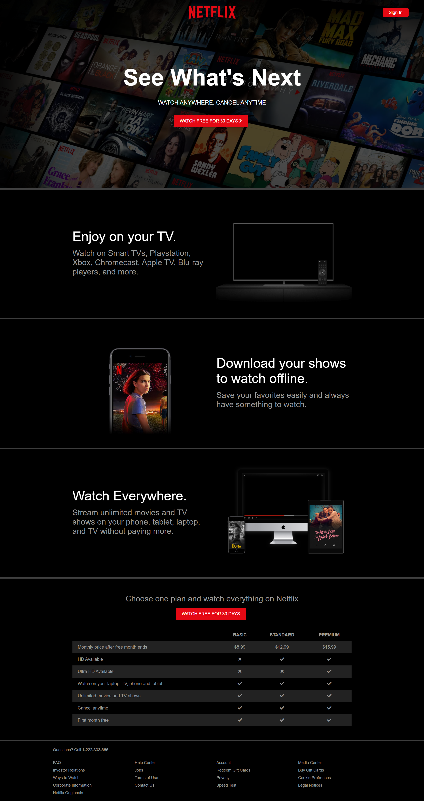

<!-- PROJECT LOGO -->
<br />
<p align="center">
  <a href="https://github.com/othneildrew/Best-README-Template">
    
  </a>

  <h3 align="center">Netflix Landing Page Clone - UI</h3>

  <p align="center">
    This is a simple Netflix Landing Page UI clone for learning purpose
    <br />
    <a href="https://github.com/nomanmajeed/netflix-ui-clone"><strong>Explore the docs »</strong></a>
    <br />
    <br />
    ·
    <a href="https://github.com/nomanmajeed/netflix-ui-clone/issues">Report Bug</a>
    ·
    <a href="https://github.com/nomanmajeed/netflix-ui-clone/issues">Request Feature</a>
  </p>
</p>


<!-- ABOUT THE PROJECT -->
## About The Project



I have been using Netflix for about a year and few days back I though why not to build a Netflix Landing Page clone. And now at last I gave it a real shape. Check it out and suggest me any improvement. 

App Story:
* The UI is built for learning purpose and for boosting my web development skills specially in CSS.
* I enjoyed it's development smile:

Of course, no one perfect and I feel myself still in learning phase of software development. There might be any zig zag flow of data and any bugs in this app. Feel free to create issues if you find any bug or have some suggestion

A list of commonly used resources that I find helpful are listed in the acknowledgements.

### Built With
This section should list major framework/add-ons/plugins used in this project.
* [CSS](https://laravel.com)
* [HTML](https://laravel-livewire.com/)


<!-- GETTING STARTED -->
## Getting Started

This is an example of how you may give instructions on setting up your project locally.
To get a local copy up and running follow these simple example steps.

1. Clone the repo
```sh
git clone https://github.com/nomanmajeed/netflix-ui-clone.git
```
3. Save the files and run.


<!-- ROADMAP -->
## Roadmap

See the [open issues](https://github.com/nomanmajeed/netflix-ui-clone/issues) for a list of proposed features (and known issues).


<!-- CONTRIBUTING -->
## Contributing

Contributions are what make the open source community such an amazing place to be learn, inspire, and create. Any contributions you make are **greatly appreciated**.

1. Fork the Project
2. Create your Feature Branch (`git checkout -b feature/AmazingFeature`)
3. Commit your Changes (`git commit -m 'Add some AmazingFeature'`)
4. Push to the Branch (`git push origin feature/AmazingFeature`)
5. Open a Pull Request


<!-- LICENSE -->
## License

Distributed under the my own License. See `LICENSE` for more information.


<!-- CONTACT -->
## Contact

Numan Malik - [@twitter](https://twitter.com/nomanmajeed986) - nomanmajeed986@gmail.com

Project Link: [https://github.com/nomanmajeed/netflix-ui-clone](https://github.com/nomanmajeed/netflix-ui-clone)


